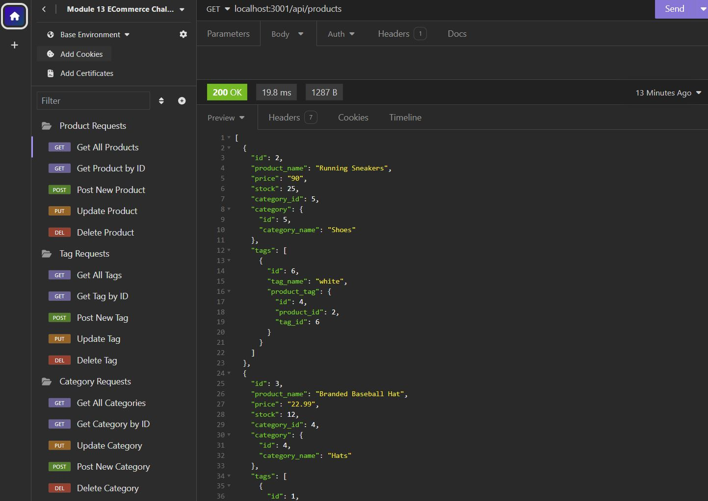

# Ecommerce Database Project

## Description
This project entailed the creation of an ecommerce database with multiple tables containing data a vendor's products, as well as the tags and categories used to sort those products in their catalog.  Additionally, the project necessitated the creation of various api routes to get, add, update, or delete information from the database.  

## Installation
This is a node project, so installation of this project will require the user to have the latest version of nodejs downloaded.  Further, this project necessitates the use of postgreSQL, which the user must also have downloaded. 

To install this project, one must first clone this repo to their local device.  Then, navigate to the repository in their local integrated development environment and install the necessary packages using the "npm install" command in the terminal.  This will install the necessary npm packages for this project, namely "pg", "sequelize", and "dotenv".  

Next, the user will have to create their own .env  file in the root of the repo and create three environment variables: DB_USER, DB_PASSWORD, and DB_NAME.  DB_NAME they will set to 'ecommerce_db' and the other two variables represent the username and password for postgreSQL.    

The user will then need to create their database within postgreSQL by navigating to the db folder of the project, logging into their postgres user, and running the command "\i schema.sql". Having done this, the user can now run the program from the command line with the command "npm start".  The api requests can then be made through Insomnia or another similar client.

## Usage
The following is a screenshot of an Insomnia client indicating the types and number of routes that this project can accomodate, as well as a portion of the response receive from an example "get all" route:

The following is a link to a walkthrough video that demonstrates all of the functionality of the program:
[Ecommerce Database Walkthrough Video](https://drive.google.com/file/d/1mlFyh4KM5QN6yuIoUyRZ-jc6YcSdn8Mz/view)

## Contributing
N/A

## Tests
N/A

## Credits
This application draws heavily from the Module 13 mini project, particularly for the syntax of the api routes.

